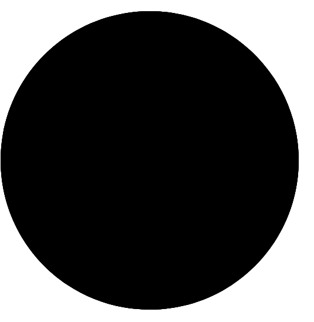
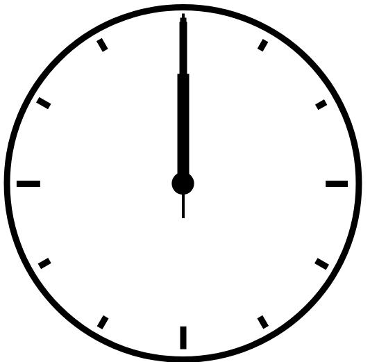

# Analog clock

**Features**
- Animated analog clock
- On page refresh continues running

**The Tech**
- HTML
- SVG
- CSS
- Javascript

Preview
[Code Pen](https://codepen.io/elvingarcia/pen/RwGmjbB)

## Notes

1. The base image on to the page.

2. The next step was to add CSS to the base image.

3. Final step was to add some animation by scripting the clock movement.

## HTML
SVG was used to render the base image of the analog clock. Shown on step 1.

## CSS
The CSS property `fill:none` was used to undarken the middle of the circle.
The `stroke-width:9` was used to display the circumference (the edges around) of the circle. The hour, minute and second arms aling with the hour marks uses the same properties with different values inorder to distinguish them apart. These properties are:
 `fill` ,`stroke`  ,`stroke-width` ,`stroke-miterlimit`

## Javascript
 - With Javascript we set a 3 variables to represent the hour hand, minute hand and the second hand. It's value were grab from the document using `querySelector` - Variables were also set for the hour, minute and seconds. The values are determines by the `Date` object's properties `getHours()`, `getMinutes()` and `getSeconds()`.
- The positon of the hands were determine by setting up variables to represent the hour, minute and second positions. Their values were determine by arithmetics. Please checkout lines 10 thru 12 on script.js file.
- Inorder to update the hands on the clock `setInterval` was used to runTheClock at 1000 miliseconds using the `transform` css property.

## References
[MDN | HTML | CSS | Javascript](https://developer.mozilla.org/en-US/docs/Web#web_technology_references)

